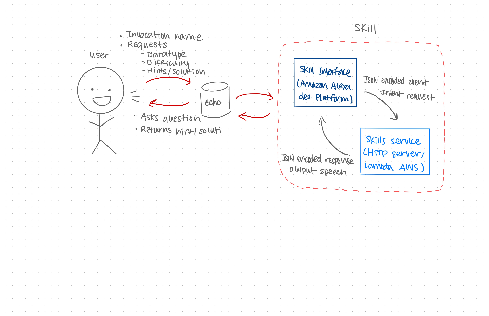

# Oh of One AWS Lambda Function

This Lambda function is essentially middleware between the Alexa skill and the backend.

It takes in the input from the Alexa device, calls the corresponding route on our backend and using the information recieved sends the Alexa device some text to read.

#### UML

